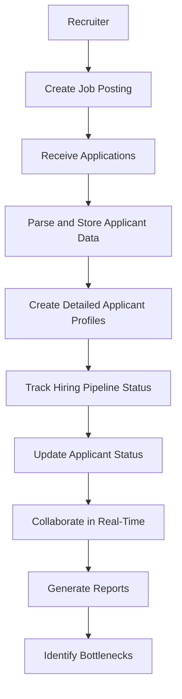
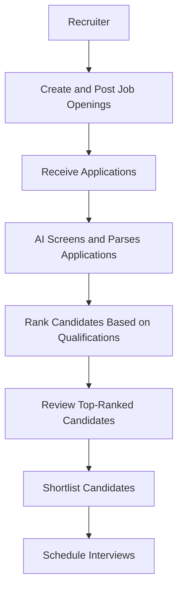

# 1. Description of the product
LTI ATS is a next-generation applicant tracking system designed to revolutionize the hiring process. Unlike traditional ATS solutions, LTI ATS leverages advanced AI and automation to streamline recruitment, enhance collaboration, and provide data-driven insights. Our system centralizes all applicant information, offers detailed profiles, and tracks candidates through the hiring pipeline. With AI-powered candidate ranking, optimized application forms, and job postings, LTI ATS ensures that recruiters and hiring managers can identify the best talent efficiently. Additionally, our AI assists in making final hiring decisions based on interview feedback, reducing bias and improving accuracy. LTI ATS integrates seamlessly with multiple job boards, automating job postings and expanding your reach. Experience the future of hiring with LTI ATS – where efficiency, collaboration, and intelligence converge to transform your recruitment process.

## Lean Canvas for LTI Applicant Tracking System (ATS)

### 1. Customer Segments
- **HR Teams**: Recruiters and hiring managers looking to streamline their hiring process.
- **Small to Medium-Sized Businesses (SMBs)**: Companies that need an efficient and cost-effective hiring solution.
- **Enterprises**: Large organizations seeking advanced AI and automation features to handle high-volume recruitment.

### 2. Value Propositions
- **Centralized Applicant Information**: Store all applicant data in one place for easy access and management.
- **Detailed Applicant Profiles**: Comprehensive profiles with all relevant information.
- **Hiring Pipeline Tracking**: Real-time tracking of applicant statuses through the hiring process.
- **AI-Powered Candidate Ranking**: Use AI to rank candidates based on their CVs and fit for the role.
- **AI-Optimized Application Forms and Job Postings**: Improve the quality and effectiveness of application forms and job postings.
- **AI-Assisted Decision Making**: Help recruiters make final hiring decisions based on interview feedback.
- **Automated Job Posting**: Automatically post jobs to multiple job boards to reach a wider audience.

### 3. Channels
- **Online Marketing**: SEO, content marketing, and social media campaigns.
- **Partnerships**: Collaborations with job boards and HR tech companies.
- **Direct Sales**: Targeted outreach to HR teams and decision-makers in SMBs and enterprises.
- **Webinars and Events**: Educational webinars and industry events to showcase the product.

### 4. Customer Relationships
- **Personal Assistance**: Dedicated customer support and account managers.
- **Self-Service**: User-friendly platform with comprehensive documentation and tutorials.
- **Community**: Online forums and user groups for peer support and best practice sharing.

### 5. Revenue Streams
- **Subscription Plans**: Monthly or annual subscription plans based on the number of users and features.
- **Premium Features**: Additional fees for advanced AI and automation features.
- **Custom Integrations**: Charges for custom integrations with other HR systems.
- **Consulting Services**: Consulting and training services for optimal use of the ATS.

### 6. Key Resources
- **Technology**: Advanced AI algorithms and robust software infrastructure.
- **Talent**: Skilled developers, data scientists, and HR experts.
- **Partnerships**: Strategic partnerships with job boards and HR tech companies.
- **Customer Data**: Secure and compliant storage of applicant data.

### 7. Key Activities
- **Product Development**: Continuous improvement and innovation of the ATS platform.
- **Marketing and Sales**: Effective marketing campaigns and sales strategies to attract and retain customers.
- **Customer Support**: Providing excellent customer support and training.
- **Data Analysis**: Analyzing user data to improve AI algorithms and platform features.

### 8. Key Partners
- **Job Boards**: Integration partners for automated job posting.
- **HR Tech Companies**: Partners for complementary HR solutions.
- **AI and Machine Learning Providers**: Collaborations for advanced AI capabilities.
- **Industry Experts**: Consultants and advisors for HR best practices.

### 9. Cost Structure
- **Development Costs**: Salaries for developers, data scientists, and HR experts.
- **Marketing and Sales**: Budget for online marketing, events, and sales activities.
- **Infrastructure**: Costs for hosting, data storage, and security.
- **Customer Support**: Expenses for customer support and training.
- **Partnerships**: Fees for integrations and collaborations with partners.

# 2. Use cases
## Use Case 1: Streamlined Applicant Management
HR teams and recruiters can efficiently manage all applicant information in one centralized location. The system provides detailed applicant profiles, including resume parsing and comprehensive data storage. Users can track the status of each applicant through the hiring pipeline in real-time, ensuring that no candidate falls through the cracks. This use case enhances organization and visibility, allowing recruiters to focus on high-value tasks rather than administrative burdens.

## Use Case 2: AI-Powered Candidate Screening and Ranking
Leveraging advanced AI algorithms, LTI ATS automatically screens and ranks candidates based on their CVs and fit for the role. This feature helps recruiters quickly identify the most suitable candidates, reducing the time spent on manual screening. The AI also optimizes application forms and job postings to attract the best talent, ensuring that the hiring process is both efficient and effective. This use case significantly improves the quality of hire and speeds up the recruitment process.

## Use Case 3: AI-Assisted Decision Making and Optimization
LTI ATS assists recruiters and hiring managers in making final hiring decisions by analyzing interview feedback and providing AI-driven insights. The system collects and processes feedback from interviewers, using AI to generate recommendations and reduce bias. This use case ensures that hiring decisions are based on data and insights rather than subjective opinions, leading to more accurate and fair hiring outcomes. Additionally, the system's reporting and analytics features provide valuable metrics and trends to inform future hiring strategies.

